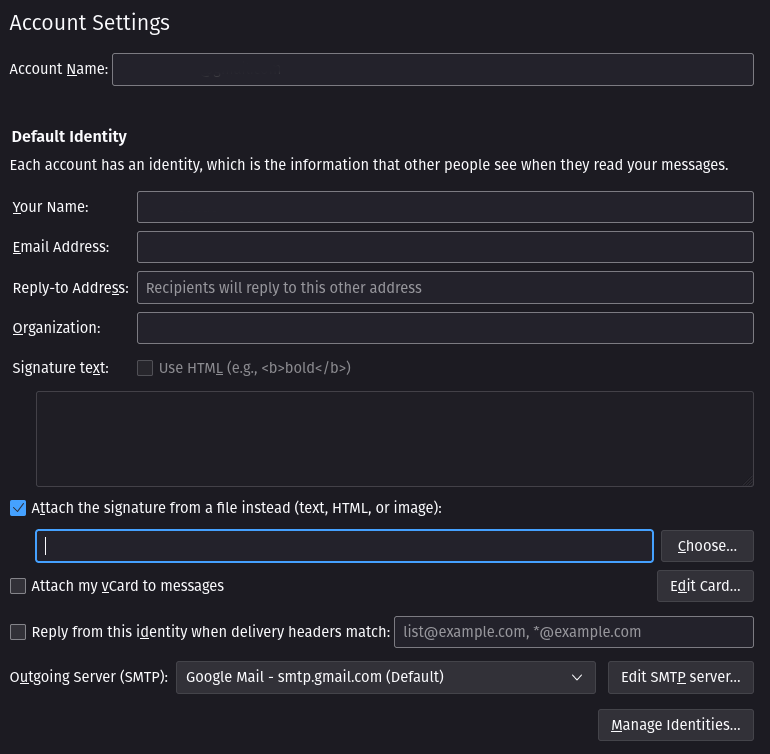
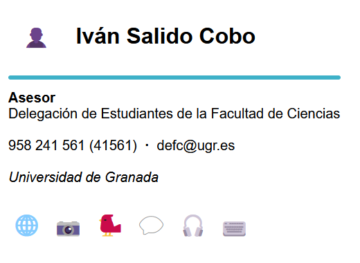

# Firmas para el correo

Aquí se guardarán todas las firmas HTML que vaya haciendo para los correos electrónicos, principalmente para:
- [Delegación de Estudiantes de la Facultad de Ciencias (DEFC)](https://defc.ugr.es)
- [Delegación General de Estudiantes (DGE)](https://dge.ugr.es)

Las firmas parten de una base que supongo que será de @jesusjmma y, actualmente, utilizan iconos de [Tabler Icons](https://tabler-icons.io/)

## Clientes de correo soportados

Las pruebas no han sido muy exhaustivas, pero la firma en algunos sitios va bien :green_circle:, regulinchi :orange_circle: y mal :red_circle:. Esta es la lista:

:green_circle: Webmail
:green_circle: Thunderbird

:orange_circle: Gmail web
:orange_circle: Gmail móvil

:red_circle: Canary Mail

## Cómo usar las firmas

Si alguien ha llegado hasta aquí es raro que no sepa usar las firmas, pero yo lo dejo por aquí por si acaso.

> **ATENCIÓN:** Estas instrucciones se revisaron por última vez el 10 de julio de 2023, es posible que ya no sirvan *(sobre todo las de webmail)*.

### En Thunderbird

Simplemente hay que irse a la configuración de la cuenta, marcar la casilla de utilizar un archivo como firma y seleccionar el archivo de firma descargado:



### En Webmail

El archivo de firma es un HTML y tiene la siguiente estructura:

```html
<!DOCTYPE html>
<html>
  <head>
    <meta http-equiv="Content-Type" content="text/html; charset=UTF-8">
    <title></title>
  </head>
  <body>
    <div>
      ...
    </div>
  </body>
</html>
```

Pues para webmail recomiendo solo copiar la parte de

```html
<div>
  ...
</div>
```

Y pegarla en el apartado de configuración de Webmail, en "Identidades", dándole al botón que hay más a la derecha que parece `< >`. Este botón es para editar la firma como HTML. Se abrirá una ventana donde hay que pegar el código copiado, sustituyendo todo lo que hubiera antes.

**¿Por qué la recomendación de copiar solo esa parte de la firma HTML?**

Simplemente porque pegando todo el contenido del archivo se pone un espacio en blanco al principio de la firma y es molesto eliminarlo manualmente.


## Ejemplos de firmas

A continuación hay unas capturas de cómo se deberían de ver las firmas.

### Ejemplo de firma de la DEFC

Cuando los iconos cargan, la firma se debería de ver así:


Y cuando no cargan, así:



### Ejemplo de firma de la DGE

Cuando los iconos cargan, la firma se debería de ver así:


Y cuando no cargan, así:

