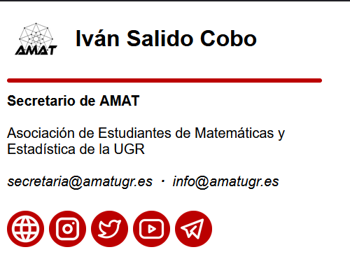
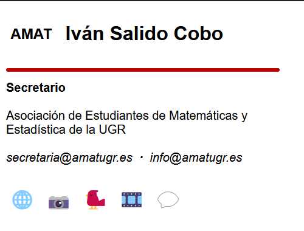
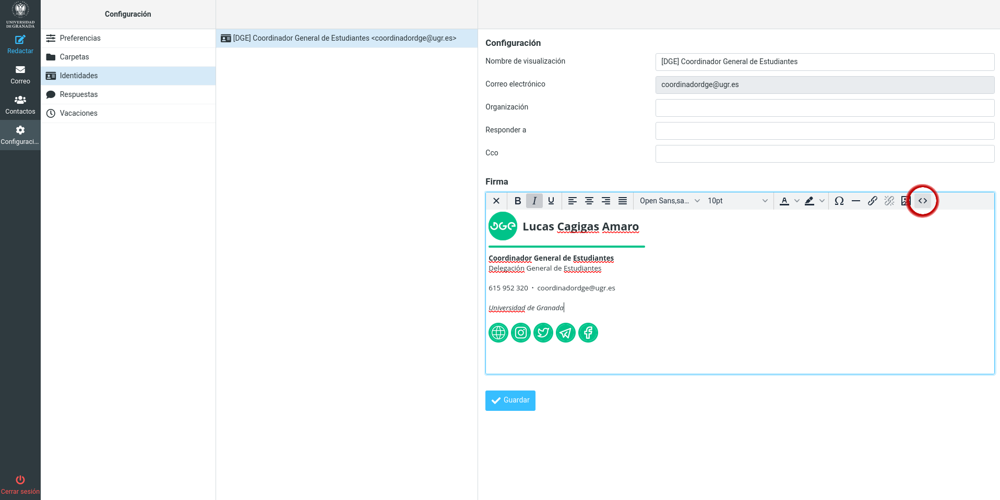

# Generador de firmas para el correo

Este script de Python permite generar las firmas para el correo siguiendo un archivo de configuración correspondiente a la entidad para la que es la firma (que incluye cosas como fuentes y colores) y otro archivo con los datos de las personas para las que generar la firma.

Aquí también se guardarán todas las firmas HTML que vaya haciendo para los correos electrónicos, principalmente para:

- [Delegación de Estudiantes de la Facultad de Ciencias (DEFC)](https://defc.ugr.es)
- [Delegación General de Estudiantes (DGE)](https://dge.ugr.es)
- [Asociación de Estudiantes de Matemáticas y Estadística de la UGR (AMAT)](https://amatugr.es)

Las firmas parten de una base que supongo que será de @jesusjmma y, actualmente, utilizan iconos de [Tabler Icons](https://tabler-icons.io)

---

## Ejemplos de firmas

A continuación hay unas capturas de cómo se deberían de ver las firmas.

### Ejemplo de firma de la DEFC

Cuando los iconos cargan, la firma se debería de ver así:


Y cuando no cargan, así:


### Ejemplo de firma de la DGE

Cuando los iconos cargan, la firma se debería de ver así:


Y cuando no cargan, así:


### Ejemplo de firma de AMAT

Cuando los iconos cargan, la firma se debería de ver así:



Y cuando no cargan, así:



## Cómo usar las firmas

> [!IMPORTANT] Importante
> Estas instrucciones se revisaron por última vez el 6 de febrero de 2024, es posible que ya no sirvan.

### En Thunderbird

Simplemente hay que irse a la configuración de la cuenta, marcar la casilla de utilizar un archivo como firma y seleccionar el archivo de firma descargado:


### En Webmail

El archivo de firma es un HTML y tiene la siguiente estructura:

```html
<!DOCTYPE html>
<html>
  <head>
    <meta http-equiv="Content-Type" content="text/html; charset=UTF-8" />
    <title></title>
  </head>
  <body>
    <div>...</div>
  </body>
</html>
```

Pues para webmail recomiendo solo copiar la parte de

```html
<div>...</div>
```

Y pegarla en el apartado de configuración de Webmail, en "Identidades", dándole al botón que hay más a la derecha que parece `< >`. Este botón es para editar la firma como HTML. Se abrirá una ventana donde hay que pegar el código copiado, sustituyendo todo lo que hubiera antes.



**¿Por qué la recomendación de copiar solo esa parte de la firma HTML?**

Simplemente porque pegando todo el contenido del archivo se pone un espacio en blanco al principio de la firma y es molesto eliminarlo manualmente.

## Cómo usar el script

> Instrucciones para Linux. Para Windows podrían variar ligeramente.

Para generar firmas, primero hay que clonar o descargar este repositorio y es recomendable crear un entorno virtual con `python3 -m venv ./.env`, seleccionarlo e instalar [Jinja2](https://pypi.org/project/Jinja2/) con `pip install Jinja2 schema`.

Lo primero que debes hacer es asegurarte de que tienes definida la configuración del tipo de firma en el archivo `signatures.json`. El archivo debe de seguir la siguiente estructura:

```json
[
  {
    "id": "",
    "output_path": "",
    "main_font": "",
    "name_font": "",
    "name_image": "",
    "color": "",
    "organization": "",
    "organization_extra": "",
    "phone": "",
    "phone_country_code": "",
    "internal_phone": "",
    "opt_mail": "",
    "max_width": 0,
    "links": [
      {
        "url": "",
        "image": "",
        "alt": ""
      }
    ]
  }
]
```

Donde todas son obligatorias salvo las que se especifican como opcionales y significan:

- `id` es el nombre de la firma que se mostrará a la hora de seleccionarla.
- `output_path` es el nombre de la carpeta en la que se generarán este tipo de firmas.
- `main_font` es la fuente de texto principal de la firma.
- `name_font` es la fuente de texto del nombre de la persona.
- `name_image` es el enlace a la imagen al lado del nombre.
- `color` es el código hexadecimal del color que usa la firma.
- `organization` es el nombre de la entidad.
- `organization_extra` _(OPCIONAL)_ es por si la entidad pertenece a otra.
- `phone` _(OPCIONAL)_ es el número de teléfono _(sin el código internacional)_ y se puede escribir con espacios.
- `phone_country_code` _(OPCIONAL)_ es el código internacional del teléfono con el +.
- `internal_phone` _(OPCIONAL)_ es por si hay un número de teléfono interno.
- `opt_mail` _(OPCIONAL)_ es por si no hay número de teléfono y se quiere mostrar un segundo correo genérico.
- `max_width` _(OPCIONAL)_ es por si se quiere limitar la longitud horizontal máxima de la firma para que si el nombre de la organización es demasiado largo se parta en varias líneas.
- `links` _(OPCIONAL)_ es la lista de enlaces incluídos en la firma donde cada enlace tiene que ser un objeto con la URL `url`, el enlace a su imagen, `image` y el texto (o emoji) a mostrar si la imagen no carga, `alt`.

Una vez esté la configuración definida hay que crear la lista de firmas a generar, que es un archivo CSV con el nombre que se quiera (`signatures_list.csv` por defecto) que debe seguir la siguiente estructura:

- La primera fila son columnas, que pueden estar tanto en mayúscula como en minúscula, dentro de las que deben estar las siguientes:

```json
["name", "position", "mail"]
```

- También se pueden incluir las siguientes columnas que, en caso de tener algo, sustituirán a lo que haya especificado en la configuración general de la firma. Se puede escribir `None` en la fila si se quiere eliminar para esa firma concreta un valor de configuración por defecto de los que eran opcionales.

```json
["output", "phone", "phone_country_code", "internal_phone", "opt_mail", "organization_extra", "main_font", "name_font", "max_width"]
```

Es recomendable añadir la columna `output` para especificar el nombre del archivo en el que guardar la firma.

El resto de filas del CSV son los datos correspondientes a cada columna, siendo cada fila una firma a generar con dichos datos.

Finalmente se pueden generar las firmas con `python3 generator.py`.

## Clientes de correo soportados

Las pruebas no han sido muy exhaustivas, pero la firma en algunos sitios va bien :green*circle:, regulinchi *(se ve bien en general pero puede fallar en algún detalle)\_ :yellow_circle: y mal :red_circle:. Esta es la lista:

:green_circle: Webmail

:green_circle: Thunderbird

:yellow_circle: Outlook web

:yellow_circle: Outlook móvil

:yellow_circle: Gmail web

:yellow_circle: Gmail móvil

:red_circle: Canary Mail

## Tareas pendientes

- Al comprobar el CSV solo comprueba los nombres de las columnas, permitiendo que haya filas en las que una columna obligatoria esté vacía.
